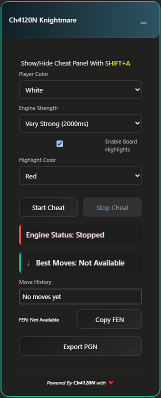

    
    <h1>Ch4120N Knightmare</h1>
    
    
    

`Ch4120N Knightmare` is an advanced and powerful extension for browsers, specifically designed for those who want to gain an undetectable advantage in online chess games, especially on Chess.com. This cheat uses complex algorithms and real-time analysis to seamlessly integrate into your game, providing top-tier strategies for winning every match. No trace or sign of cheat activity remains in the game, and all actions are carried out automatically and discreetly.

## 👀 Screenshot

